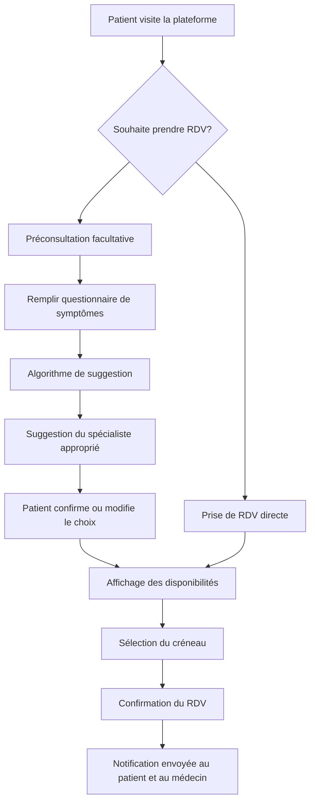

# Analyse Comparative & Plan du Mémoire

## Votre Projet
**Titre :** Conception et réalisation d'une plateforme intelligente de préconsultation et de prise de rendez-vous médicaux en ligne : Cas d'une clinique privée au Sénégal

**Objectif général :** Concevoir et réaliser une plateforme web intégrant un module de préconsultation facultative et un système intelligent de suggestion afin d'optimiser la prise de rendez-vous médicaux dans une clinique privée au Sénégal.

---

## Document de Référence
**Titre :** Développement d'une plateforme de gestion des rendez-vous médicaux : cas du service de santé militaire

**Auteure :** Mme. HANANE Abderemane — Licence Professionnelle en Informatique Appliquée à la Gestion des Entreprises, ISI Dakar, 2024-2025

---

## 1. SIMILITUDES ENTRE LES DEUX PROJETS

### 1.1 Domaine et Contexte
- Les deux projets s'inscrivent dans le **secteur de la santé numérique** au Sénégal
- Les deux sont réalisés à l'**ISI (Institut Supérieur d'Informatique)** de Dakar
- Les deux répondent à la **problématique de la gestion des rendez-vous médicaux**
- Les deux s'appuient sur le constat du **manque de médecins en Afrique** (2 médecins pour 10 000 habitants selon l'OMS)
- Les deux visent à **digitaliser des processus manuels** chronophages

### 1.2 Fonctionnalités Communes
| Fonctionnalité | HANANE | Votre Projet |
|---|---|---|
| Gestion des utilisateurs (inscription, connexion) | ✅ | ✅ |
| Prise de rendez-vous en ligne | ✅ | ✅ |
| Gestion des plannings médicaux | ✅ | ✅ |
| Gestion des services/spécialités | ✅ | ✅ |
| Notifications et rappels | ✅ | ✅ |
| Interface patient | ✅ | ✅ |
| Interface médecin | ✅ | ✅ |
| Interface administrateur | ✅ | ✅ |

### 1.3 Approche Méthodologique Commune
- Utilisation du **langage de modélisation UML** (diagrammes de cas d'utilisation, diagramme de classes)
- Analyse des **besoins fonctionnels et non fonctionnels**
- Architecture **MVC (Model-View-Controller)**
- Développement **Full-Stack** (Frontend + Backend séparés)
- Utilisation de **Laravel** comme framework backend PHP
- Utilisation de **PostgreSQL** comme SGBD
- Utilisation de **Figma** pour le prototypage des interfaces
- Utilisation de **Git/GitHub** pour la gestion de version

### 1.4 Structure du Document
Les deux mémoires partagent la même structure académique ISI :
- Dédicace
- Remerciements
- Avant-propos
- Sommaire
- Glossaire
- Liste des figures
- Liste des tableaux
- Résumé / Abstract
- Chapitres principaux
- Bibliographie / Webographie
- Table des matières

---

## 2. DIFFÉRENCES ENTRE LES DEUX PROJETS

### 2.1 Contexte et Cadre d'Application
| Critère | HANANE (Référence) | Votre Projet |
|---|---|---|
| **Structure d'accueil** | Service de Santé Militaire des Comores | Clinique privée au Sénégal |
| **Public cible** | Militaires, retraités et familles | Grand public, patients civils |
| **Contraintes spécifiques** | Sécurité militaire, hiérarchie | Contraintes commerciales, rentabilité |
| **Volume** | 36 000 consultations/an | À définir selon la clinique |

### 2.2 Fonctionnalités Distinctives (Votre Valeur Ajoutée)
| Fonctionnalité | HANANE | Votre Projet |
|---|---|---|
| **Module de préconsultation** | ❌ Absent | ✅ **CORE FEATURE** — Questionnaire médical préalable facultatif |
| **Système intelligent de suggestion** | ❌ Absent | ✅ **CORE FEATURE** — IA/algorithme de recommandation de spécialiste |
| **Chatbot d'assistance** | ❌ Non atteint | ✅ Intégré dans le module intelligent |
| **Algorithme Smart Slot** | Mentionné mais non détaillé | ✅ Système de suggestion de créneaux optimaux |
| **Orientation automatique** | ❌ Absent | ✅ Suggestion du bon médecin selon les symptômes |

### 2.3 Technologies Frontend
| Critère | HANANE | Votre Projet |
|---|---|---|
| **Framework Frontend** | Angular 18 | À définir (React.js recommandé ou Angular) |
| **Langage** | TypeScript | TypeScript |

### 2.4 Niveau de Complexité
- **HANANE** : Plateforme de gestion standard des rendez-vous
- **Votre projet** : Plateforme **intelligente** avec couche d'IA/ML pour la préconsultation et la suggestion — niveau de complexité supérieur

### 2.5 Innovation Principale
- **HANANE** : Digitalisation d'un processus existant
- **Votre projet** : **Innovation** avec un module de préconsultation qui collecte les symptômes du patient AVANT le rendez-vous, puis suggère intelligemment le bon spécialiste et le bon créneau

---

## 3. STRUCTURE PROPOSÉE POUR VOTRE MÉMOIRE

En s'inspirant fidèlement de la structure du document de référence, voici la structure complète adaptée à votre projet :

---

### PAGES LIMINAIRES (Avant les chapitres)

```
Page de garde
Dédicace
Remerciements
Avant-propos (présentation de l'ISI + contexte du projet)
Sommaire
Glossaire
Liste des figures
Liste des tableaux
Résumé (français)
Abstract (anglais)
```

---

### CHAPITRE 1 : INTRODUCTION GÉNÉRALE

**1.1 Présentation de la structure d'accueil**
- Présentation de la clinique privée (nom, localisation, services, organisation)
- Organigramme de la clinique
- Missions et activités

**1.2 Contexte**
- Problématique de la santé numérique en Afrique/Sénégal
- Limites des systèmes manuels de prise de rendez-vous
- Problème spécifique : patients qui consultent le mauvais spécialiste
- Besoin d'une préconsultation intelligente
- Justification de la solution numérique

**1.3 Sujet du projet de fin de cycle**
- Description détaillée de la plateforme intelligente
- Module de préconsultation facultative
- Système de suggestion intelligent
- Périmètre fonctionnel

**1.4 Objectifs du projet**
- Objectif général
- Objectifs spécifiques :
  1. Système de gestion des utilisateurs
  2. Module de préconsultation (questionnaire médical)
  3. Système intelligent de suggestion de spécialiste
  4. Interface de prise de rendez-vous optimisée
  5. Gestion des plannings médicaux
  6. Gestion des services et spécialités
  7. Notifications et rappels

---

### CHAPITRE 2 : TRAVAUX RÉALISÉS ET OUTILS/TECHNOLOGIES

**2.1 Liste des travaux**

**2.1.1 Travail N°1 : Spécification des Besoins**
- 2.1.1.1 Besoins fonctionnels (tableau détaillé par module)
- 2.1.1.2 Besoins non fonctionnels

**2.1.2 Travail N°2 : Modélisation de la Solution Proposée**
- 2.1.2.1 Choix du langage de modélisation UML
- 2.1.2.2 Diagramme de cas d'utilisation général
- 2.1.2.3 Diagramme de cas d'utilisation : Gestion des Utilisateurs
- 2.1.2.4 Diagramme de cas d'utilisation : Préconsultation
- 2.1.2.5 Diagramme de cas d'utilisation : Système de Suggestion
- 2.1.2.6 Diagramme de cas d'utilisation : Gestion des Rendez-vous
- 2.1.2.7 Diagramme de cas d'utilisation : Gestion des Plannings
- 2.1.2.8 Diagramme de cas d'utilisation : Gestion des Services
- 2.1.2.9 Diagramme de classes
- 2.1.2.10 Diagramme de séquence (flux de préconsultation)

**2.1.3 Travail N°3 : Design et Ergonomie des IHM**
- Page d'accueil / Landing page
- Page d'inscription / Connexion
- Page de préconsultation (questionnaire)
- Page de suggestion de spécialiste
- Page de prise de rendez-vous
- Page de suivi des rendez-vous (patient)
- Tableau de bord médecin
- Tableau de bord secrétaire/admin

**2.1.4 Travail N°4 : Implémentation**
- 2.1.4.1 Environnement technique
  - 2.1.4.1.1 Outils utilisés (matériels et logiciels)
  - 2.1.4.1.2 Technologies utilisées (Backend : Laravel/PHP, Frontend : React.js ou Angular, BD : PostgreSQL, IA : Python/API ou algorithme de scoring)
- 2.1.4.2 Réalisation des travaux applicatifs
  - Création du backend (Laravel)
  - Implémentation du module de préconsultation
  - Implémentation du système de suggestion intelligent
  - Création du frontend
  - Interfaces et captures d'écran

---

### CHAPITRE 3 : CONCLUSION GÉNÉRALE / BILAN

**3.1 Vérification des objectifs**
- Objectif 1 : Gestion des utilisateurs — atteint/non atteint
- Objectif 2 : Module de préconsultation — atteint/non atteint
- Objectif 3 : Système de suggestion intelligent — atteint/non atteint
- Objectif 4 : Interface de prise de rendez-vous — atteint/non atteint
- Objectif 5 : Gestion des plannings — atteint/non atteint
- Objectif 6 : Gestion des services — atteint/non atteint
- Objectif 7 : Notifications et rappels — atteint/non atteint

**3.2 Intérêts**
- 3.2.1 Intérêt personnel (compétences acquises)
- 3.2.2 Intérêt pour la clinique (impact opérationnel)

---

### PAGES FINALES

```
Bibliographie
Webographie
Table des matières
```

---

## 4. DIAGRAMME DE FLUX — MODULE DE PRÉCONSULTATION (Votre Innovation Clé)



---

## 5. TABLEAU COMPARATIF FINAL — MODULES

| Module | HANANE Abderemane | Votre Projet |
|---|---|---|
| Gestion des utilisateurs | ✅ Complet | ✅ Complet |
| Préconsultation intelligente | ❌ Absent | ✅ **Innovation majeure** |
| Suggestion de spécialiste | ❌ Absent | ✅ **Innovation majeure** |
| Prise de rendez-vous | ✅ Complet | ✅ Amélioré |
| Gestion des plannings | ✅ Complet | ✅ Complet |
| Gestion des services | ✅ Complet | ✅ Complet |
| Notifications/Rappels | ✅ Complet | ✅ Complet |
| Chatbot | ❌ Non atteint | ✅ Intégré dans le module IA |
| Architecture | MVC + REST API | MVC + REST API |
| Backend | Laravel + PHP | Laravel + PHP |
| Frontend | Angular 18 | React.js ou Angular |
| Base de données | PostgreSQL | PostgreSQL |
| Modélisation | UML | UML |

---

## 6. POINTS D'ATTENTION POUR VOTRE RÉDACTION

1. **Présentation de la clinique** : Vous devez avoir une structure d'accueil réelle (clinique privée au Sénégal). Préparez les informations : nom, localisation, services offerts, nombre de médecins, volume de consultations.

2. **Le module de préconsultation** est votre **différenciateur principal** — il doit être très bien documenté avec :
   - Le questionnaire médical (liste des symptômes, arbre de décision)
   - L'algorithme de scoring/suggestion
   - Les diagrammes UML spécifiques

3. **Le système intelligent** : Précisez si vous utilisez :
   - Un algorithme de règles métier (if/else basé sur les symptômes)
   - Un modèle de machine learning
   - Une API d'IA externe (ex: OpenAI)

4. **Les diagrammes UML** doivent être plus nombreux que dans le document de référence car votre projet est plus complexe.

5. **Le glossaire** doit inclure les termes spécifiques à votre projet : IA, préconsultation, système de suggestion, scoring, etc.
