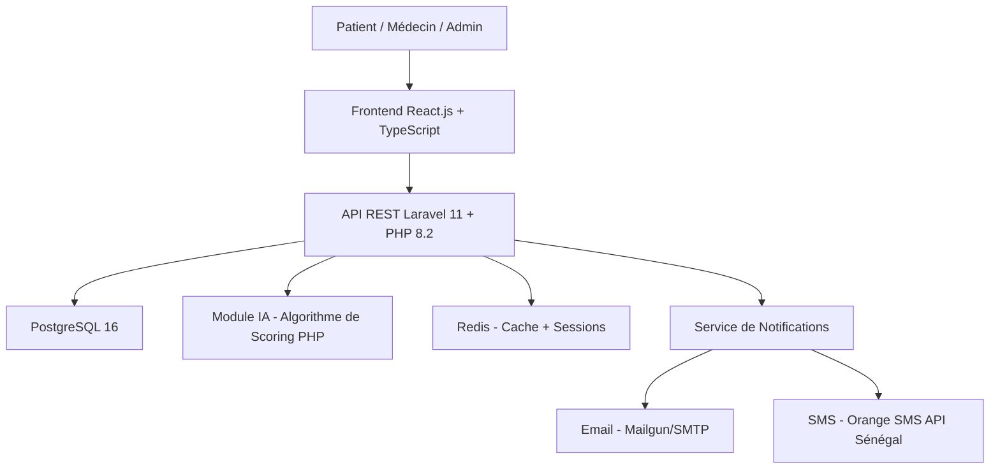
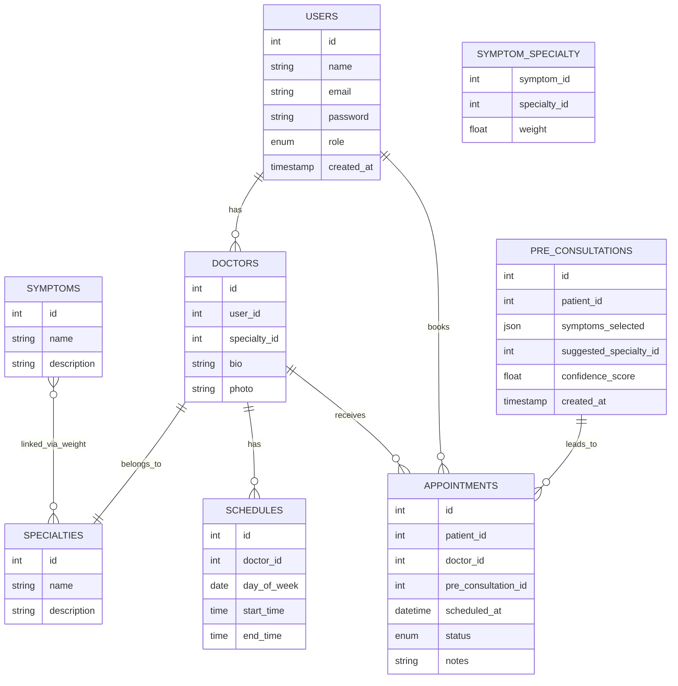
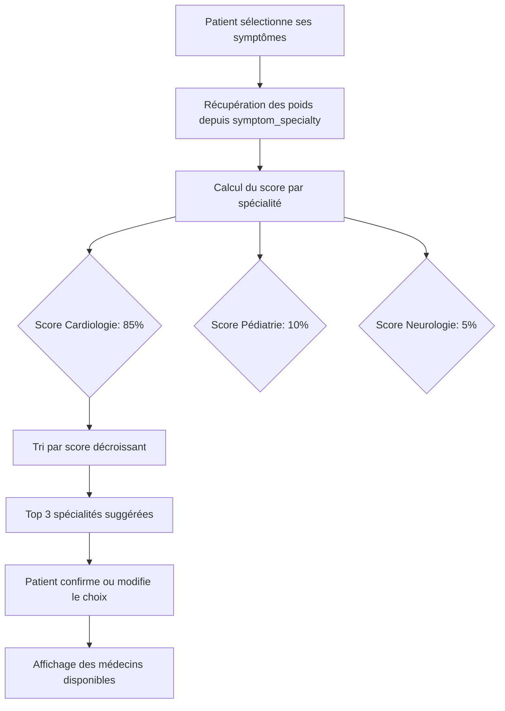
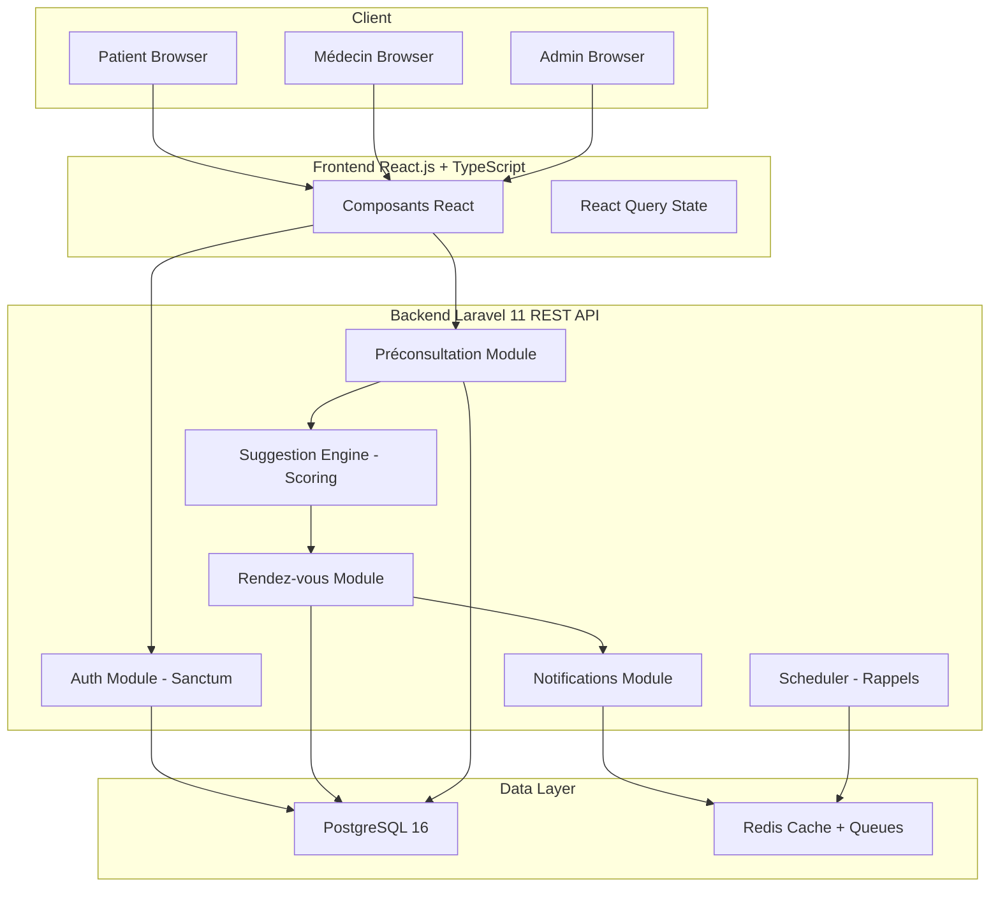

# Architecture & Recommandations Techniques — Plateforme Intelligente de Préconsultation Médicale

## Votre Projet
**Titre :** Conception et réalisation d'une plateforme intelligente de préconsultation et de prise de rendez-vous médicaux en ligne : Cas d'une clinique privée au Sénégal

---

## 1. STACK TECHNOLOGIQUE RECOMMANDÉ

### Vue d'ensemble



---

## 2. FRONTEND — React.js + TypeScript

### Pourquoi React plutôt qu'Angular ?
- Plus léger et plus rapide à développer pour un projet de fin de cycle
- Écosystème plus riche pour les composants UI médicaux
- Meilleure flexibilité pour intégrer des visualisations de planning
- Courbe d'apprentissage plus douce

### Bibliothèques clés

| Bibliothèque | Usage |
|---|---|
| React 18 + TypeScript | Base du frontend |
| TailwindCSS | Styling rapide et professionnel |
| React Query (TanStack) | Gestion des appels API + cache |
| React Hook Form + Zod | Formulaire de préconsultation avec validation |
| FullCalendar | Affichage des plannings médecins |
| Axios | Appels HTTP vers l'API Laravel |
| React Router v6 | Navigation entre les pages |
| Recharts | Graphiques pour le dashboard admin |

### Pages à développer

1. **Landing Page** — Présentation de la clinique + CTA
2. **Inscription / Connexion** — Authentification patient/médecin/admin
3. **Page de Préconsultation** — Questionnaire de symptômes (étapes progressives)
4. **Page de Suggestion** — Résultat de l'algorithme + confirmation du spécialiste
5. **Page de Prise de RDV** — Calendrier de disponibilités + sélection de créneau
6. **Dashboard Patient** — Mes rendez-vous, historique préconsultations
7. **Dashboard Médecin** — Planning, liste des RDV du jour
8. **Dashboard Admin/Secrétaire** — Gestion globale, statistiques

---

## 3. BACKEND — Laravel 11 + PHP 8.2

### Architecture MVC + REST API

Laravel reste le choix standard à l'ISI. Voici les modules à implémenter :

| Module Laravel | Description |
|---|---|
| Laravel Sanctum | Authentification API par tokens |
| Laravel Notifications | Envoi d'emails et SMS |
| Laravel Queues + Redis | Envoi asynchrone des notifications |
| Laravel Policies | Gestion des rôles (patient, médecin, admin) |
| Laravel Scheduler | Rappels automatiques de RDV |

### Structure des Routes API

```
POST   /api/auth/register          — Inscription
POST   /api/auth/login             — Connexion
GET    /api/specialties            — Liste des spécialités
GET    /api/doctors                — Liste des médecins
GET    /api/doctors/{id}/slots     — Créneaux disponibles
POST   /api/pre-consultations      — Soumettre questionnaire
GET    /api/pre-consultations/{id}/suggestion — Résultat suggestion
POST   /api/appointments           — Créer un RDV
GET    /api/appointments           — Mes RDV
PUT    /api/appointments/{id}      — Modifier un RDV
DELETE /api/appointments/{id}      — Annuler un RDV
GET    /api/admin/dashboard        — Stats admin
```

---

## 4. BASE DE DONNÉES — PostgreSQL 16

### Schéma des Tables Principales



### Table Pivot Clé : `symptom_specialty`

C'est le coeur de votre algorithme de suggestion. Chaque symptôme est lié à une ou plusieurs spécialités avec un **poids (weight)** entre 0 et 1 :

| symptom_id | specialty_id | weight |
|---|---|---|
| douleur_thoracique | cardiologie | 0.90 |
| douleur_thoracique | pneumologie | 0.60 |
| fievre_enfant | pediatrie | 0.95 |
| maux_de_tete | neurologie | 0.80 |
| maux_de_tete | ophtalmologie | 0.40 |

---

## 5. MODULE IA — ALGORITHME DE SCORING (Recommandé pour Licence)

### Pourquoi l'algorithme de scoring plutôt que le ML pur ?
- Plus réaliste à implémenter dans le temps imparti
- Plus facile à expliquer et défendre devant un jury
- Résultats prévisibles et contrôlables
- Pas besoin de dataset d'entraînement

### Fonctionnement de l'Algorithme



### Formule de Calcul du Score

```
Score(spécialité S) = Σ(poids(symptôme i, S)) / nombre_de_symptômes_sélectionnés
```

**Exemple :**
- Patient sélectionne : douleur_thoracique + essoufflement + fatigue
- Score Cardiologie = (0.90 + 0.85 + 0.70) / 3 = **0.817 → 82%**
- Score Pneumologie = (0.60 + 0.90 + 0.40) / 3 = **0.633 → 63%**
- **Suggestion : Cardiologue (82% de correspondance)**

### Implémentation PHP dans Laravel

```php
// app/Services/SpecialtySuggestionService.php
public function suggest(array $symptomIds): array
{
    $scores = [];
    foreach ($symptomIds as $symptomId) {
        $links = SymptomSpecialty::where('symptom_id', $symptomId)->get();
        foreach ($links as $link) {
            $scores[$link->specialty_id] = ($scores[$link->specialty_id] ?? 0) + $link->weight;
        }
    }
    arsort($scores);
    return array_slice($scores, 0, 3, true); // Top 3
}
```

---

## 6. FONCTIONNALITÉS PRIORISÉES

### Priorité 1 — Core (Obligatoire pour la soutenance)

- [ ] Authentification (inscription/connexion) avec rôles
- [ ] Gestion des spécialités et médecins
- [ ] Module de préconsultation (questionnaire de symptômes)
- [ ] Algorithme de suggestion de spécialiste
- [ ] Prise de rendez-vous avec calendrier de disponibilités
- [ ] Confirmation et annulation de RDV

### Priorité 2 — Important

- [ ] Dashboard médecin (planning + liste des RDV)
- [ ] Dashboard admin (gestion globale)
- [ ] Notifications email (confirmation de RDV)
- [ ] Gestion des plannings médecins (créneaux)

### Priorité 3 — Bonus (si le temps le permet)

- [ ] Chatbot d'assistance (intégration OpenAI ou règles simples)
- [ ] Notifications SMS (Orange SMS API Sénégal)
- [ ] Historique des préconsultations
- [ ] Statistiques et graphiques admin
- [ ] Export PDF des RDV

---

## 7. OUTILS DE DÉVELOPPEMENT

| Outil | Usage |
|---|---|
| VS Code | IDE principal |
| Figma | Prototypage UI/UX |
| Postman | Test des API REST |
| Docker + Laravel Sail | Environnement de développement local |
| Git + GitHub | Versioning |
| draw.io ou StarUML | Diagrammes UML |
| pgAdmin 4 | Administration PostgreSQL |
| Mailtrap | Test des emails en développement |

---

## 8. ARCHITECTURE GLOBALE DU SYSTÈME



---

## 9. RÉSUMÉ DES CHOIX TECHNOLOGIQUES

| Couche | Technologie | Justification |
|---|---|---|
| **Frontend** | React.js 18 + TypeScript | Moderne, rapide, riche en composants |
| **Styling** | TailwindCSS | Productivité, design professionnel |
| **Backend** | Laravel 11 + PHP 8.2 | Standard ISI, MVC, REST API |
| **Base de données** | PostgreSQL 16 | Robuste, relationnel, standard ISI |
| **Module IA** | Algorithme de scoring PHP | Réaliste pour Licence, défendable |
| **Cache/Queues** | Redis | Sessions + files d'attente notifications |
| **Auth** | Laravel Sanctum | Tokens API sécurisés |
| **Notifications** | Laravel Mail + SMTP | Email de confirmation obligatoire |
| **Versioning** | Git + GitHub | Standard professionnel |
| **Déploiement** | VPS Linux ou Railway.app | Simple pour la démo de soutenance |

---

## 10. POINTS D'ATTENTION CRITIQUES

1. **Le module de préconsultation** est votre différenciateur principal — documentez-le très bien avec l'arbre de décision et les diagrammes UML spécifiques.

2. **L'algorithme de scoring** doit être expliqué clairement dans le mémoire avec la formule mathématique et des exemples concrets.

3. **La table `symptom_specialty`** avec les poids est le coeur de votre IA — préparez un catalogue de 20-30 symptômes couvrant les principales spécialités de la clinique.

4. **Les diagrammes UML** doivent inclure au minimum :
   - Diagramme de cas d'utilisation général
   - Diagramme de cas d'utilisation : Préconsultation
   - Diagramme de cas d'utilisation : Suggestion
   - Diagramme de classes
   - Diagramme de séquence : flux complet préconsultation → RDV

5. **La présentation de la clinique** est obligatoire — vous devez avoir une structure d'accueil réelle avec nom, localisation, services, organigramme.
