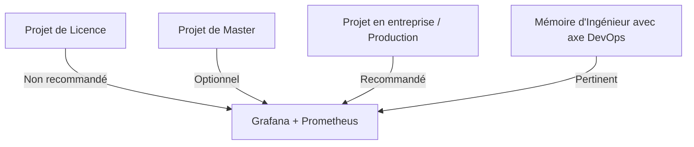

# Grafana & Prometheus — Pertinence pour Votre Projet de Licence

---

## Ce que sont Grafana et Prometheus

| Outil | Rôle |
|---|---|
| **Prometheus** | Système de collecte et stockage de métriques (monitoring) — scrape les données de performance de votre application |
| **Grafana** | Tableau de bord de visualisation — affiche les métriques collectées par Prometheus sous forme de graphiques |

### Ensemble, ils permettent de surveiller :
- La charge CPU / mémoire du serveur
- Le nombre de requêtes HTTP par seconde
- Les temps de réponse de l'API
- Les erreurs 4xx / 5xx
- L'état de la base de données PostgreSQL

---

## HANANE Abderemane les a-t-elle utilisés ?

**Non.** Le document de HANANE ne mentionne ni Grafana, ni Prometheus, ni aucun outil de monitoring. Son environnement se limite à :
- PhpStorm, Figma, StarUML, Postman, pgAdmin 4, Git/GitHub

---

## Devez-vous les utiliser dans votre projet de Licence ?

### Réponse courte : **Non, ce n'est pas nécessaire pour une Licence**

### Pourquoi ?

| Critère | Analyse |
|---|---|
| **Niveau académique** | Grafana/Prometheus sont des outils DevOps/SRE utilisés en production d'entreprise — pas attendus à ce niveau |
| **Complexité** | Leur mise en place nécessite Docker, configuration de scraping, dashboards — temps non justifié pour une Licence |
| **Valeur ajoutée pour le jury** | Le jury ISI évalue la plateforme médicale, pas l'infrastructure de monitoring |
| **Votre différenciateur** | Votre valeur ajoutée est le module de préconsultation + algorithme de suggestion, pas le monitoring |

---

## Quand Grafana/Prometheus deviennent pertinents ?

---

## Ce que vous pouvez faire à la place (adapté à votre niveau)

Si vous voulez montrer une capacité de monitoring sans la complexité de Grafana/Prometheus :

### Option 1 — Dashboard Admin avec statistiques (Recommandé ✅)
Intégrez dans votre dashboard admin des **statistiques métier** :
- Nombre de RDV par jour/semaine/mois
- Taux d'utilisation du module de préconsultation
- Spécialités les plus demandées
- Médecins les plus sollicités

**Outils :** Recharts (React) ou Chart.js — simple à intégrer, très visuel pour la soutenance.

### Option 2 — Laravel Telescope (Optionnel)
[Laravel Telescope](https://laravel.com/docs/telescope) est un outil de debug/monitoring intégré à Laravel :
- Visualise les requêtes HTTP, les requêtes SQL, les jobs en queue
- Facile à installer : `composer require laravel/telescope`
- Utile en développement, pas besoin de Grafana

### Option 3 — Logs applicatifs Laravel
Laravel intègre nativement un système de logs via [Monolog](https://github.com/Seldaek/monolog) :
- Logs des erreurs, des connexions, des actions importantes
- Stockés dans `storage/logs/laravel.log`
- Suffisant pour un projet de Licence

---

## Résumé de la Recommandation

| Outil | Recommandation pour votre Licence |
|---|---|
| **Grafana + Prometheus** | ❌ Pas nécessaire — trop complexe, hors scope |
| **Dashboard admin avec Recharts** | ✅ Recommandé — valeur ajoutée visible pour le jury |
| **Laravel Telescope** | ✅ Optionnel — utile en développement |
| **Logs Laravel natifs** | ✅ Suffisant — déjà intégré |

**Concentrez votre énergie sur votre innovation principale : le module de préconsultation et l'algorithme de suggestion de spécialiste.** C'est ce qui vous différencie de HANANE et ce que le jury va évaluer.
