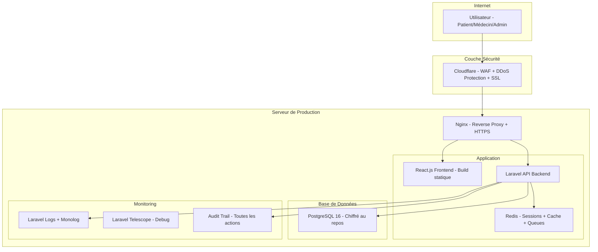
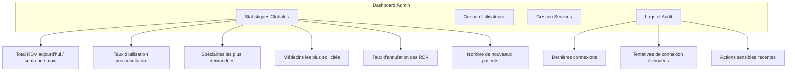
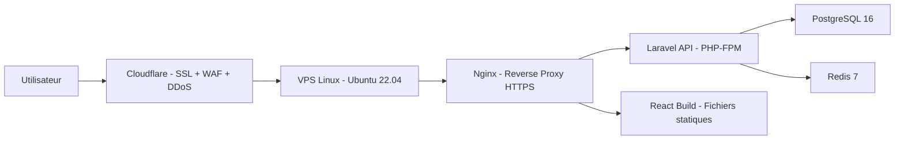

# Plan Final — Plateforme Intelligente de Préconsultation Médicale

> **Choix validés par le client**

---

## STACK VALIDÉ

```
┌─────────────────────────────────────────────────────────────────┐
│                    STACK FINAL VALIDÉ                            │
├──────────────────┬──────────────────────────────────────────────┤
│ FRONTEND         │ React.js 18 + TypeScript + TailwindCSS        │
│ BACKEND          │ Laravel 12 + PHP 8.2 (MVC + REST API)         │
│ BASE DE DONNÉES  │ PostgreSQL 16 + pgAdmin 4                     │
│ CACHE/QUEUES     │ Redis 7                                       │
│ MODULE IA        │ Algorithme de scoring PHP (règles métier)      │
│ NOTIFICATIONS    │ Email (SMS en perspectives futures)            │
│ IDE              │ VS Code                                       │
│ DÉPLOIEMENT      │ En ligne (sécurisé)                           │
│ SÉCURITÉ         │ Priorité maximale (données patients)          │
│ MONITORING       │ Logs + Reporting + Dashboard statistiques     │
└──────────────────┴──────────────────────────────────────────────┘
```

---

## 1. ARCHITECTURE SÉCURISÉE

### Vue d'ensemble



---

## 2. SÉCURITÉ — PLAN DÉTAILLÉ

### 2.1 Authentification et Autorisation

| Mesure | Implémentation | Détail |
|---|---|---|
| **Authentification par tokens** | Laravel Sanctum | Tokens API sécurisés, expiration automatique |
| **Hachage des mots de passe** | bcrypt (Laravel natif) | Jamais stockés en clair |
| **Rôles et permissions** | Laravel Policies + Gates | Patient, Médecin, Secrétaire, Admin — chaque rôle a des accès limités |
| **Validation des entrées** | Laravel Form Requests + Zod (frontend) | Toutes les données sont validées côté serveur ET client |
| **Protection CSRF** | Laravel CSRF Token | Inclus nativement |
| **Rate Limiting** | Laravel Rate Limiter | Limite le nombre de requêtes par IP (anti brute-force) |
| **Expiration de session** | Config Laravel | Sessions expirées après inactivité |

### 2.2 Protection des Données Patients

| Mesure | Implémentation | Détail |
|---|---|---|
| **HTTPS obligatoire** | Certificat SSL Let's Encrypt via Nginx | Toutes les communications chiffrées |
| **Chiffrement des données sensibles** | Laravel Crypt (AES-256) | Données médicales chiffrées en base |
| **Chiffrement au repos** | PostgreSQL avec pgcrypto | Données chiffrées sur le disque |
| **Variables d'environnement** | Fichier .env (jamais commité) | Clés API, mots de passe BDD jamais dans le code |
| **CORS configuré** | Laravel CORS middleware | Seul le frontend autorisé peut appeler l'API |
| **Headers de sécurité** | Nginx + Laravel middleware | X-Frame-Options, X-Content-Type-Options, Strict-Transport-Security |

### 2.3 Protection contre les Attaques

| Attaque | Protection |
|---|---|
| **Injection SQL** | Eloquent ORM (requêtes paramétrées) — jamais de SQL brut |
| **XSS (Cross-Site Scripting)** | React échappe automatiquement le HTML + CSP headers |
| **CSRF** | Laravel CSRF protection native |
| **Brute Force** | Rate limiting sur login (5 tentatives/minute) |
| **DDoS** | Cloudflare WAF (couche gratuite disponible) |
| **Man-in-the-Middle** | HTTPS obligatoire + HSTS |
| **Accès non autorisé** | Middleware d'authentification sur toutes les routes API |

### 2.4 Conformité Données de Santé

| Principe | Implémentation |
|---|---|
| **Minimisation des données** | Ne collecter que les données strictement nécessaires |
| **Consentement** | Checkbox de consentement avant la préconsultation |
| **Droit d'accès** | Le patient peut voir toutes ses données |
| **Droit de suppression** | Le patient peut demander la suppression de son compte |
| **Journalisation** | Toutes les actions sur les données patients sont tracées (audit trail) |

---

## 3. LOGS ET AUDIT TRAIL

### 3.1 Système de Logs

| Type de Log | Outil | Contenu |
|---|---|---|
| **Logs applicatifs** | Laravel Monolog | Erreurs, warnings, infos — stockés dans `storage/logs/` |
| **Logs d'accès** | Nginx access.log | Toutes les requêtes HTTP avec IP, timestamp, status |
| **Logs d'erreurs** | Nginx error.log + Laravel | Erreurs 4xx/5xx détaillées |
| **Logs de sécurité** | Custom middleware Laravel | Tentatives de connexion échouées, accès refusés |

### 3.2 Audit Trail (Traçabilité des Actions)

Chaque action sensible est enregistrée dans une table `audit_logs` :

| Champ | Description |
|---|---|
| `id` | Identifiant unique |
| `user_id` | Qui a fait l'action |
| `action` | Type d'action (login, create, update, delete, view) |
| `model` | Sur quel objet (appointment, user, pre_consultation) |
| `model_id` | ID de l'objet concerné |
| `old_values` | Anciennes valeurs (JSON) |
| `new_values` | Nouvelles valeurs (JSON) |
| `ip_address` | Adresse IP de l'utilisateur |
| `user_agent` | Navigateur utilisé |
| `created_at` | Date et heure |

**Exemples d'actions tracées :**
- Connexion/déconnexion d'un utilisateur
- Création/modification/annulation d'un rendez-vous
- Accès au dossier d'un patient
- Modification du profil d'un médecin
- Toute action admin (blocage, suppression d'utilisateur)

---

## 4. DASHBOARD ET STATISTIQUES

### 4.1 Dashboard Admin



### 4.2 Statistiques à Afficher (avec Recharts)

| Graphique | Type | Données |
|---|---|---|
| **RDV par jour/semaine/mois** | Graphique en barres | Nombre de RDV créés |
| **Répartition par spécialité** | Camembert (Pie chart) | % de RDV par spécialité |
| **Taux d'utilisation préconsultation** | Jauge (Gauge) | % de patients ayant utilisé la préconsultation |
| **Top 5 médecins** | Barres horizontales | Médecins avec le plus de RDV |
| **Évolution mensuelle** | Courbe (Line chart) | Tendance des RDV sur 12 mois |
| **Taux d'annulation** | KPI card | % de RDV annulés |
| **Nouveaux patients** | KPI card | Nombre de nouveaux inscrits ce mois |

### 4.3 Dashboard Médecin

| Élément | Description |
|---|---|
| **RDV du jour** | Liste des patients à voir aujourd'hui |
| **Planning de la semaine** | Calendrier avec créneaux occupés/libres |
| **Statistiques personnelles** | Nombre de consultations ce mois, taux d'annulation |
| **Préconsultations reçues** | Résumé des symptômes déclarés par les patients |

### 4.4 Dashboard Patient

| Élément | Description |
|---|---|
| **Mes RDV** | Liste avec statut (en attente, confirmé, annulé) |
| **Prochain RDV** | Rappel visuel du prochain rendez-vous |
| **Historique préconsultations** | Mes questionnaires passés |

---

## 5. DÉPLOIEMENT SÉCURISÉ EN LIGNE

### Option Recommandée : VPS Linux + Cloudflare



### Configuration Sécurité du Serveur

| Mesure | Détail |
|---|---|
| **Firewall UFW** | Seuls les ports 80, 443, 22 ouverts |
| **SSH par clé** | Pas de connexion par mot de passe |
| **Fail2Ban** | Blocage automatique des IP après tentatives échouées |
| **Mises à jour automatiques** | `unattended-upgrades` activé |
| **Backups automatiques** | Sauvegarde quotidienne de PostgreSQL |
| **Cloudflare WAF** | Protection contre les attaques web (gratuit) |
| **Let's Encrypt SSL** | Certificat HTTPS gratuit renouvelé automatiquement |

### Hébergeurs Recommandés

| Hébergeur | Prix | Avantage |
|---|---|---|
| **Hostinger VPS** | ~5€/mois | Bon rapport qualité/prix |
| **DigitalOcean** | ~6$/mois | Fiable, bonne documentation |
| **Contabo** | ~5€/mois | Très bon prix pour les ressources |
| **Railway.app** | Gratuit (limité) | Facile à déployer, PostgreSQL inclus |

---

## 6. MODULES FONCTIONNELS — PLAN D'IMPLÉMENTATION

### Phase 1 — Fondations (Priorité maximale)

| # | Module | Description |
|---|---|---|
| 1 | **Setup projet** | Laravel 12 + React.js + PostgreSQL + configuration sécurité |
| 2 | **Authentification** | Inscription, connexion, rôles (patient, médecin, secrétaire, admin) |
| 3 | **Gestion des spécialités** | CRUD des spécialités médicales |
| 4 | **Gestion des médecins** | Profils médecins liés aux spécialités |

### Phase 2 — Core Business

| # | Module | Description |
|---|---|---|
| 5 | **Module de préconsultation** | Questionnaire de symptômes (formulaire multi-étapes) |
| 6 | **Algorithme de suggestion** | Scoring PHP — table symptom_specialty avec poids |
| 7 | **Prise de rendez-vous** | Calendrier de disponibilités + réservation |
| 8 | **Gestion des plannings** | Créneaux par médecin (création, modification) |

### Phase 3 — Dashboards et Monitoring

| # | Module | Description |
|---|---|---|
| 9 | **Dashboard admin** | Statistiques globales + gestion utilisateurs/services |
| 10 | **Dashboard médecin** | Planning + liste patients + stats personnelles |
| 11 | **Dashboard patient** | Mes RDV + historique préconsultations |
| 12 | **Audit trail** | Table audit_logs + middleware de traçabilité |
| 13 | **Logs et reporting** | Monolog + logs de sécurité |

### Phase 4 — Notifications et Finalisation

| # | Module | Description |
|---|---|---|
| 14 | **Notifications email** | Confirmation RDV + rappels |
| 15 | **Sécurité avancée** | Rate limiting, headers, CORS, chiffrement |
| 16 | **Déploiement** | VPS + Nginx + SSL + Cloudflare |
| 17 | **Tests et corrections** | Tests fonctionnels + corrections de bugs |

### Perspectives Futures (après soutenance)

| # | Module | Description |
|---|---|---|
| 18 | **SMS** | Intégration Orange SMS API Sénégal |
| 19 | **Chatbot** | Assistant conversationnel |
| 20 | **Application mobile** | React Native ou Flutter |

---

## 7. STRUCTURE DES TABLES POSTGRESQL

### Tables principales

```
users              — id, name, email, password, role, phone, is_active, created_at
doctors            — id, user_id, specialty_id, bio, photo, license_number
specialties        — id, name, description, icon
symptoms           — id, name, description, category
symptom_specialty  — id, symptom_id, specialty_id, weight (0.0 à 1.0)
pre_consultations  — id, patient_id, symptoms_json, suggested_specialty_id, confidence_score, created_at
appointments       — id, patient_id, doctor_id, pre_consultation_id, scheduled_at, status, notes
schedules          — id, doctor_id, day_of_week, start_time, end_time, is_available
notifications      — id, user_id, type, title, message, is_read, created_at
audit_logs         — id, user_id, action, model, model_id, old_values, new_values, ip_address, user_agent, created_at
```

### Données sensibles chiffrées (AES-256)

- `pre_consultations.symptoms_json` — symptômes déclarés par le patient
- `appointments.notes` — notes médicales
- `users.phone` — numéro de téléphone

---

## 8. RÉSUMÉ FINAL

| Aspect | Choix |
|---|---|
| **Frontend** | React.js 18 + TypeScript + TailwindCSS |
| **Backend** | Laravel 12 + PHP 8.2 |
| **Base de données** | PostgreSQL 16 |
| **Module IA** | Algorithme de scoring PHP (règles métier) |
| **Notifications** | Email (SMS en perspectives) |
| **Sécurité** | HTTPS, bcrypt, AES-256, Sanctum, Rate Limiting, CORS, CSP, Cloudflare WAF |
| **Logs** | Monolog + Audit Trail + Logs Nginx |
| **Dashboard** | Recharts — statistiques admin, médecin, patient |
| **Déploiement** | VPS Linux + Nginx + Cloudflare + Let's Encrypt |
| **IDE** | VS Code |
| **Versioning** | Git + GitHub |
| **Prototypage** | Figma |
| **UML** | StarUML |
| **Test API** | Postman |
